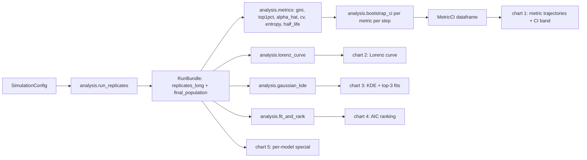
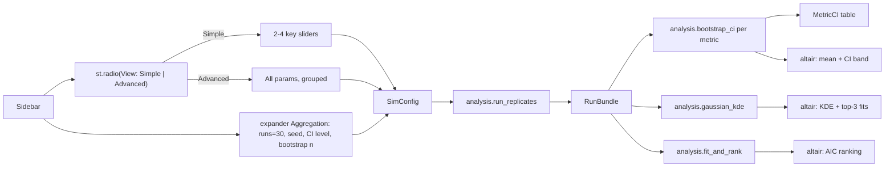

## 1. Locked constraints

- **In-browser deploy stays**. Stlite 1.7.3 + Pyodide 0.29.3 (per `src/stlite_hello/site/config.py`).
- **Use SciPy / statsmodels**, pinned to Pyodide-bundled versions so micropip never tries to build them:
  - `scipy==1.14.1`, `statsmodels==0.14.4`, `networkx==3.4.2`.
  - These get added to `[project].dependencies` **and** to `pyodide_bundle_packages` (so the site build aligns them) **and** to `pyodide_constraint_packages` (so the host venv pins to the same versions). Then `uv run poe sync-pyodide-constraints` + `uv lock`.
- **All data flows through Pandera-typed DataFrames** (`pandera.pandas.DataFrameModel`), as in the current `WaveData` example.
- **All plots are Altair**.
- **Per-feature seed**: every feature exposes its own `seed` knob in its `SimulationConfig`; nothing is shared across features, no global RNG state mutated. Replicate seeds are spawned via `numpy.random.SeedSequence(seed).spawn(runs)` for deterministic, independent streams.
- **Higher-level abstractions first**: `scipy.stats.bootstrap` for CIs, `scipy.stats.gaussian_kde` for KDE, `scipy.stats.fit` (1.11+ API) for MLE, `networkx` for the matching market graph and preferential-attachment graph. All scipy/statsmodels imports are confined to `analysis/adapters/`; the rest of the codebase consumes narrowly-typed wrappers (§4.2).
- **No new ignores anywhere — config or source.** `uv run poe check` (prek → ruff + ruff-format + mypy strict + pylint) must pass at every commit. No new `# noqa`, no `# type: ignore`, no `# pylint: disable`, no new entries in `[[tool.mypy.overrides]] ignore_missing_imports`, no widening of `[tool.pylint.messages_control].disable`. New findings are fixed at the source; missing third-party stubs are supplied locally in `stubs/` (§4.2).
- **One commit per feature.** Conventional Commits with a body, per user rule. Example head: `feat(simulations): add yard-sale wealth exchange model`.

## 2. Seven simulations (simple → complex)

Two of them (Yard-Sale and Sugarscape) emit naturally Pareto wealth distributions, as requested. Each gets a **non-cliché** real-world example.

- **1. Yard-Sale** — random pairwise transfers of a fraction of the loser's wealth; produces wealth condensation (Pareto / oligarchy) even with a fair coin.
  - *Real-world example*: **commission-pool redistribution in high-turnover sales teams** (winner of each deal absorbs a slice of the prospect's future commission).
- **2. Kinetic Wealth Exchange (with savings)** — Chakraborti–Chakrabarti `w' = λw + ε(1-λ)(w_i+w_j)`. With homogeneous λ → Gamma; with heterogeneous λ → Pareto tail.
  - *Real-world example*: **rotating-savings clubs (ROSCAs / tandas)** where each cycle a random member pockets the pooled contributions while the rest save a fixed fraction.
- **3. Continuous Double Auction** — buyers/sellers with private values; price-time-priority matching. Converges to Walrasian price; we report price-convergence trajectory and allocative efficiency.
  - *Real-world example*: **wholesale day-ahead electricity pool** (generators bid offers, retailers bid demand).
- **4. Cournot Oligopoly** — `N` firms with heterogeneous marginal costs play best-response on linear inverse demand; metrics: distance to Nash, HHI, profit Gini.
  - *Real-world example*: **OPEC+ crude oil quota negotiations** (each member picks output knowing rivals will react).
- **5. Sugarscape-lite** — toroidal grid with sugar capacity & regrowth; agents with vision/metabolism harvest greedily. Empirically emits a Pareto wealth distribution from local heterogeneity.
  - *Real-world example*: **artisanal alluvial gold mining** on a river bend (claims with higher yields and miners with better tools accumulate disproportionate gold).
- **6. Labor Matching (DMP-lite)** — pool of unemployed workers and posted vacancies; Cobb–Douglas matching function `m(u,v) = μ u^η v^(1-η)`; Nash wage bargaining over surplus. Metrics: unemployment rate, vacancy-filling time, wage dispersion.
  - *Real-world example*: **gig-economy ride-hailing driver–rider pairing** (drivers as workers, ride requests as vacancies, surge price as the bargained wage).
- **7. Preferential Attachment** — Barabási–Albert-style market-share dynamics via `networkx.barabasi_albert_graph` driving customer arrivals to firms with probability proportional to current customer count; emits Pareto in firm size.
  - *Real-world example*: **app-store category dominance by install count** (newcomers prefer high-install-count apps, locking in winners).

## 3. Comparable metrics and chart catalog (apples-to-apples across models)

### 3.1 Focal quantity per simulation

Every simulation exposes a single non-negative, per-agent **focal quantity** at the end of every step. This is what the cross-model metrics and charts are computed on, and it is what `analysis.schemas.FinalPopulation.value` carries.

- **Yard-Sale, Kinetic Exchange, Sugarscape** → agent wealth.
- **Double Auction** → trader surplus (consumer surplus for buyers, producer surplus for sellers).
- **Cournot** → firm profit (`(p - c_i) * q_i`).
- **Labor Matching** → worker income (wage if matched in the period, `0` otherwise).
- **Preferential Attachment** → firm market share (fraction of cumulative customers).

### 3.2 Cross-model metrics — concentration *and* mobility

All metrics live in `analysis/metrics.py`, are pure functions on the per-step focal-quantity matrix `X[run, step, agent]`, and are wrapped with `bootstrap_ci` so every reported value carries a 95% BCa CI across the `runs=30` replicates. They are stored in a single Pandera `MetricCI` table per simulation. The set has two halves: **concentration** (the state of inequality) and **mobility** (whether the agents holding wealth change).

#### Concentration metrics (six)

All six live in `analysis/metrics.py`, are pure functions on a 1-D float array, and are wrapped with `bootstrap_ci` so every reported value carries a 95% BCa CI across the `runs=30` replicates. They are stored in a single Pandera `MetricCI` table per simulation so the UI table and Altair chart can render generically.

1. **Gini coefficient** `G` — canonical inequality measure on the final focal quantity. Bounded [0, 1]. *In Yard-Sale and Preferential Attachment → 1; in Double Auction → close to 0.*
2. **Top-1% share** `S_{1%}` — fraction of total focal quantity held by the richest 1% of agents. Highlights tail concentration directly. *Reveals the "oligarchy" emergence in Yard-Sale and Sugarscape.*
3. **Pareto tail index** `α̂` — Hill estimator over the upper decile (`α̂ = 1 / mean(log x_top / x_threshold)`). Reports tail heaviness even when the global distribution is not strictly Pareto. *Distinguishes Kinetic Exchange (Gamma body, Pareto tail) from Sugarscape (Pareto everywhere).*
4. **Coefficient of variation** `CV = σ/μ` — scale-free dispersion. Lets us compare Cournot profits (in dollars) to Sugarscape wealth (in sugar units) on the same axis. *Cournot's CV collapses as the system reaches Nash; Yard-Sale's CV grows without bound.*
5. **Shannon entropy of normalized shares** `H` — `−Σ p_i log p_i` with `p_i = x_i / Σx`. High = even distribution, low = concentrated. *Inverse of HHI in spirit but bounded; falls monotonically as a winner emerges in Preferential Attachment.*
6. **Convergence half-life** `t_{1/2}` — steps to reach 50% of `|Gini(final) − Gini(initial)|`, computed per replicate, aggregated with bootstrap CI. *Double Auction and Cournot converge fast; Sugarscape and Preferential Attachment do not.*

#### Mobility metrics (five) — "is the top-percentile population stable or churning?"

All operate on the per-step focal-quantity matrix and use ranks (deciles, percentiles) rather than raw values, so they are directly comparable across simulations.

7. **Top-1% turnover rate** `τ_{1%}` — mean per-step fraction of the top-1% set that is *replaced* by step `t+1`. `0` = perfectly stable membership, `1` = full replacement each step. *Answers "is the population in the top % stable or fluctuating?"* — reported in the headline table and plotted over time.
8. **Top-1% persistence rate** `π_{1%}` — `1 − τ_{1%}` (kept as its own row so a glance at the table answers "what fraction of last step's top-1% are still top-1%?"). Reported per step and aggregated.
9. **Mean top-1% tenure** `T_{1%}` — average length, in simulation steps, of a contiguous spell in the top 1% across all (agent, run) pairs (right-censored spells at horizon end are included with a Kaplan–Meier-style correction via `statsmodels`). *Answers "what is the average time an agent is in the top 1%?"*
10. **Bottom→top rise count** `R_{10→90}` — count of (agent, run) pairs whose decile rank moves from ≤ bottom 10% at some step `s` to ≥ top 10% at some later step `t > s`, normalized by total (agent, run) pairs. *Answers "can agents raise from the bottom decile to the top decile?"* with a number, not prose.
11. **Median time-to-rise** `Δt_{10→90}` — for the agents counted by `R_{10→90}`, the median number of steps from the first bottom-decile observation to the first top-decile observation. Reported alongside the count so the answer is fully quantitative.

These five mobility metrics, combined with the six concentration metrics above, expose the *intrinsic character* of each model on both axes: Yard-Sale and Preferential Attachment hit max concentration **and** minimum mobility (winners freeze); Double Auction minimizes concentration **and** keeps churn high; Cournot is fast-converging on concentration with low post-convergence mobility; Kinetic Exchange combines moderate concentration with surprisingly high mobility because the savings rule keeps every agent in play.

### 3.3 Five common charts (rendered by every simulation)

All four are pure Altair builders in `analysis/charts.py`, consume Pandera-typed dataframes, and are called identically from every feature `page.py`.

1. **Metric trajectories with bootstrap CI band** — faceted line chart, one panel per core metric, x = step, y = mean across replicates, shaded band = bootstrap 95% CI computed on ~50 evenly-spaced step snapshots (see §4.3) so the chart stays cheap in Pyodide while remaining deterministic.
2. **Lorenz curve of the final focal quantity** — cumulative population share (x) vs cumulative focal share (y), with the 45° equality line and the Gini area shaded. Lets the user see "how far from equality" at a glance, identically for every model.
3. **KDE + top-3 fitted PDFs overlay** of the final focal quantity — `scipy.stats.gaussian_kde` as the empirical curve plus three best-AIC fits from the `analysis.distributions` catalog.
4. **AIC ranking bar chart** — ΔAIC across all six candidate distributions (`norm`, `lognorm`, `expon`, `pareto`, `gamma`, `weibull_min`), making "which distribution best matches the data" a one-glance answer per model.
5. **Mobility transition heatmap** — 10×10 decile-to-decile transition matrix from initial state to final state (or first→last sampled snapshot), color = transition probability, with the diagonal annotated. Off-diagonal mass in the (top-left → bottom-right) and (bottom-right → top-left) corners directly visualizes "can agents traverse the distribution?" — and the diagonal mass directly visualizes "is the population stable?". Backed by `analysis.metrics.decile_transition_matrix` returning a `DataFrame[DecileTransition]`.

### 3.4 Model-specific special charts (one per simulation)

Each feature adds **exactly one** additional Altair chart designed to expose an insight the four common charts cannot. These live in the feature's own `page.py` (or `charts.py` submodule) and never leak into `analysis/`.

- **Yard-Sale** — **Wealth-condensation heatmap**: y = agent rank, x = step, color = wealth share. Visualizes the slow emergence of the oligarchy.
- **Kinetic Exchange** — **Wealth vs savings rate scatter (with rolling-mean line)**: x = λ_i, y = final wealth_i, pooled across replicates. Shows the direct causal link from saving propensity to final wealth.
- **Double Auction** — **Marshallian supply–demand cross**: aggregated bid curve (descending) and ask curve (ascending) at the final round, with the theoretical Walrasian price annotated. Smith's classic visualization of convergence.
- **Cournot** — **Best-response trajectory in (q₁, q₂) space**: scatter of successive iterates overlaid on the analytic best-response lines, showing convergence to the Nash intersection. (For `N > 2`, project onto the two firms with the largest cost spread.)
- **Sugarscape** — **Spatial wealth heatmap of the final grid**: y, x = grid coordinates, color = sugar capacity, marker overlay = surviving agents sized by personal wealth. The model is spatial; the chart must be too.
- **Labor Matching** — **Beveridge curve**: unemployment rate (x) vs vacancy rate (y), one point per step, colored by step index. Canonical labor-economics chart.
- **Preferential Attachment** — **Zipf plot (log–log market-share by rank)**: log(rank) vs log(market share), with a fitted line whose slope is the empirical Zipf exponent. Makes the power-law signature visually unambiguous.

### 3.5 Data flow for the common metrics and charts



## 4. New layout

```
src/stlite_hello/
  analysis/                           # NEW shared simulation/statistics core
    __init__.py                       # re-exports public API
    config.py                         # base `AggregationConfig` (runs=30, seed, CI, bootstrap_resamples, trajectory_step_samples)
    aggregation.py                    # run_replicates: SeedSequence.spawn + reproducible loop
    bootstrap.py                      # adapters.bootstrap wrapper -> typed CIResult model
    kde.py                            # adapters.kde wrapper -> KDECurve dataframe
    distributions.py                  # adapters.distribution_fit + AIC ranking over a fixed family catalog
    metrics.py                        # six cross-model metrics: gini, top1pct, alpha_hat (Hill), cv, entropy, half_life; + lorenz_curve
    summarize.py                      # `summarize(bundle, config) -> SimulationReport`
    schemas.py                        # Pandera DataFrameModels for every payload (replicates, final, metrics, KDE, fits, Lorenz)
    charts.py                         # ALL Altair builders (4 common + helpers) — pure, Pandera-in, alt.Chart-out
    adapters/                         # NEW: the only place that imports scipy/statsmodels directly
      __init__.py
      scipy_stats.py                  # narrowly-typed wrappers: bootstrap_ci, gaussian_kde_grid, fit_distribution
      statsmodels.py                  # any statsmodels surface we end up needing (kept minimal)
stubs/                                # local .pyi stubs so mypy strict passes without `ignore_missing_imports`
  scipy/__init__.pyi
  scipy/stats/__init__.pyi
  statsmodels/__init__.pyi
  ...
  features/
    <sim>/
      __init__.py                     # re-exports model + pages + main
      __main__.py                     # 4-line standalone runner
      model.py                        # Pydantic params, Config, simulate_once()
      page.py                         # THIN: just `pages() -> list[StreamlitPage]` wiring `presentation.render`
      presentation/
        __init__.py                   # re-exports `render` and the special chart builder
        controller.py                 # `render()` — orchestrates sidebar → analysis core → sections
        sidebar.py                    # `build_config(default_seed) -> <Sim>Config` (Simple/Advanced toggle + Aggregation expander)
        sections.py                   # body sections: example callout, metrics table, common-chart panels
        special_chart.py              # per-model special-chart Altair builder (Pandera-typed inputs)
```

The seven simulation directories (`yard_sale`, `kinetic_exchange`, `double_auction`, `cournot`, `sugarscape`, `labor_matching`, `preferential_attachment`) all follow the exact same shape above.

### 4.1 Sidebar navigation grouping

`features/__init__.py` wires the seven slices into three grouped sections using `st.navigation`'s dict form, balanced 3 / 2 / 2:

- **Wealth dynamics** — `yard_sale`, `kinetic_exchange`, `sugarscape`.
- **Market structure** — `double_auction`, `cournot`.
- **Labor & networks** — `labor_matching`, `preferential_attachment`.

```python
def navigation() -> dict[str, list[StreamlitPage]]:
    return {
        "Wealth dynamics": [*yard_sale.pages(), *kinetic_exchange.pages(), *sugarscape.pages()],
        "Market structure": [*double_auction.pages(), *cournot.pages()],
        "Labor & networks": [*labor_matching.pages(), *preferential_attachment.pages()],
    }
```

`stlite_hello.app.main` then calls `st.navigation(features.navigation(), position="sidebar")`.

### 4.2 Third-party typing strategy (no new ignores anywhere)

To satisfy mypy strict **without** adding `scipy.*` / `statsmodels.*` to any `ignore_missing_imports` block:

- **`analysis/adapters/`** is the **only** package allowed to `from scipy ...` or `from statsmodels ...`. Every other module in the project goes through it.
- The adapter functions expose narrowly-typed signatures (Pydantic / Pandera in and out) and may use `typing.cast` to assert the static type of values returned by the third-party calls — `cast` is a typing construct, not an ignore.
- **`stubs/`** ships local minimal `.pyi` files for the small surface the adapters touch: `scipy.stats.bootstrap`, `scipy.stats.gaussian_kde`, `scipy.stats.fit`, and the six distribution objects (`norm`, `lognorm`, `expon`, `pareto`, `gamma`, `weibull_min`). `pyproject.toml` adds `stubs` to `[tool.mypy] mypy_path = "src:stubs"`.
- **`networkx`** ships its own inline type hints (3.x); no stub work needed.
- Result: no `# noqa`, no `# type: ignore`, no `# pylint: disable`, and the existing `[[tool.mypy.overrides]] ignore_missing_imports = true` block in `pyproject.toml` is **not** widened.

### 4.3 Bootstrap CI strategy for time-series

`analysis.summarize` evaluates the bootstrap CI **on the final-state focal quantity** at full strength (`bootstrap_resamples=2000`, BCa). For the trajectory chart, it samples ~50 evenly-spaced step snapshots (configured by `trajectory_step_samples: int = 50` on `AggregationConfig`) and runs `adapters.bootstrap_ci` on each snapshot. This keeps in-browser compute tractable while preserving deterministic bands. The snapshot count is exposed in the sidebar's Aggregation expander.

### 4.4 Caching with `st.cache_data`

Both `analysis.run_replicates` and `analysis.summarize` are wrapped in `st.cache_data`, keyed by `<Sim>Config.model_dump_json()` (frozen Pydantic → deterministic JSON → stable cache key). Concretely, the cache lives in two thin shims inside each feature's `presentation/controller.py`:

```python
@st.cache_data(show_spinner=False)
def _cached_run(config_json: str) -> RunBundle: ...

@st.cache_data(show_spinner=False)
def _cached_summary(config_json: str, bundle: RunBundle) -> SimulationReport: ...
```

Rules:

- The cache key is the **JSON of the frozen Pydantic config**, never a primitive — keeps the BaseModel-only contract intact.
- The reproducibility snapshot tests call `st.cache_data.clear()` in a session-scoped fixture so each snapshot is computed cold.
- The same fixture pattern is used in the AppTest tests under `presentation/` so cache state never crosses tests.

### 4.5 Per-simulation default sizes (target ≤ 5s for 30 runs in Pyodide)

Picked so the **Simple-view defaults** finish a full 30-replicate run + summarization in roughly five seconds inside Pyodide. Advanced view exposes much higher caps.

| Simulation | Agents/firms | Steps | Notes |
| --- | --- | --- | --- |
| yard_sale | 200 | 500 | fully vectorised pairwise |
| kinetic_exchange | 200 | 500 | fully vectorised pairwise |
| double_auction | 80 | 200 | order-book per round, vectorised matching |
| cournot | 6 firms | 60 | best-response is cheap |
| sugarscape | 25×25 grid, ≤ 150 agents | 150 | most expensive; cap grid ≤ 40×40 in Advanced |
| labor_matching | 250 workers / 100 vacancies | 200 | networkx matching kept on small graphs |
| preferential_attachment | 300 firms, m=2 | 300 customer arrivals | `nx.barabasi_albert_graph` per replicate |

Every page wraps the run in `st.spinner("Running 30 replicates...")` so the user has feedback; the speed/accuracy tradeoff is documented in the sidebar caption.

`features/home`, `features/charts`, `features/about` and their mirrored tests are **deleted in the commit that introduces the first simulation slice** (no soft-deprecation). `features/__init__.py` is rewritten to compose the seven new slices.

## 4. Shared `analysis/` core — design

**API rule (mirrors §5.0 for `presentation/`)**: every public function in `analysis/` takes and returns either a frozen Pydantic `BaseModel` or a Pandera `DataFrame[Schema]`. Pure-numpy helpers used internally are kept module-private (leading underscore) so callers — including `presentation/` — never see a raw `pd.DataFrame`, `np.ndarray`, or primitive.

The two top-level container models presentation consumes are:

```python
class RunBundle(BaseModel):
    model_config = ConfigDict(frozen=True, arbitrary_types_allowed=True)
    replicates_long: DataFrame[ReplicateLong]
    final_population: DataFrame[FinalPopulation]

class SimulationReport(BaseModel):
    model_config = ConfigDict(frozen=True, arbitrary_types_allowed=True)
    metrics_ci: DataFrame[MetricCI]                       # 11 rows: 6 concentration + 5 mobility
    metrics_ci_over_time: DataFrame[MetricCIOverTime]     # trajectories incl. τ_{1%}, π_{1%}
    lorenz: DataFrame[LorenzCurve]
    kde: DataFrame[KDECurve]
    fits: DataFrame[DistributionFit]
    fitted_densities: DataFrame[FittedDensity]            # top-3 PDF overlays
    decile_transitions: DataFrame[DecileTransition]       # 10×10 transition matrix (probabilities)
    top_pct_spells: DataFrame[TopPctSpell]                # one row per (run, agent, spell) for tenure stats
```

A single entry point `analysis.summarize(*, bundle: RunBundle, config: AggregationConfig) -> SimulationReport` runs all metric / Lorenz / KDE / fit computations and returns the typed report — so controllers do not orchestrate primitives.


### `config.py` — per-feature config base

```python
from pydantic import BaseModel, ConfigDict, Field

class AggregationConfig(BaseModel):
    model_config = ConfigDict(frozen=True)
    runs: int = Field(default=30, ge=1, le=1000)
    seed: int = Field(default=...)  # each feature sets its own default seed
    bootstrap_resamples: int = Field(default=2000, ge=200, le=20000)
    confidence_level: float = Field(default=0.95, gt=0.0, lt=1.0)
```

Each feature subclasses with its own `SimpleParams` and `AdvancedParams` (see [§5](#5-feature-slice-contract)).

### `aggregation.run_replicates`

```python
def run_replicates(
    simulate_once: Callable[[Params, np.random.Generator], ReplicateResult],
    params: Params,
    aggregation: AggregationConfig,
) -> RunBundle: ...
```

- Spawns `aggregation.runs` independent child seeds via `np.random.SeedSequence(aggregation.seed).spawn(aggregation.runs)`.
- Returns a Pandera-validated `RunBundle` containing `replicates_long: DataFrame[ReplicateLong]` (one row per (run, step, metric)) and `final_population: DataFrame[FinalPopulation]` (one row per (run, agent, value)).

### `bootstrap.bootstrap_ci`

A typed wrapper around `scipy.stats.bootstrap` returning a frozen Pydantic `CIResult(estimate, low, high, level, method)`. Default `method="BCa"`, paired with `n_resamples = aggregation.bootstrap_resamples` and a deterministic `random_state=np.random.default_rng(aggregation.seed)`.

### `kde.gaussian_kde`

Wraps `scipy.stats.gaussian_kde` with Silverman bandwidth and returns a `DataFrame[KDECurve]` (`x`, `density`) ready for Altair.

### `distributions.fit_and_rank`

- Catalog: `scipy.stats.norm`, `lognorm`, `expon`, `pareto`, `gamma`, `weibull_min`. Each fit uses `scipy.stats.fit(distribution, data, bounds=...)` → MLE; AIC = `2k - 2*loglik`.
- Returns `DataFrame[DistributionFit]` (`name`, `params_json`, `loglik`, `aic`, `delta_aic`) sorted by AIC ascending, plus a `DataFrame[FittedDensity]` (`name`, `x`, `density`) for the top-3 overlays.

### `schemas.py` — Pandera models (excerpt)

```python
class ReplicateLong(pa.DataFrameModel):
    run: pa.typing.Series[int] = pa.Field(ge=0)
    step: pa.typing.Series[int] = pa.Field(ge=0)
    metric: pa.typing.Series[str]
    value: pa.typing.Series[float]

class FinalPopulation(pa.DataFrameModel):
    run: pa.typing.Series[int] = pa.Field(ge=0)
    agent: pa.typing.Series[int] = pa.Field(ge=0)
    value: pa.typing.Series[float]

class MetricCI(pa.DataFrameModel):
    metric: pa.typing.Series[str]
    estimate: pa.typing.Series[float]
    ci_low: pa.typing.Series[float]
    ci_high: pa.typing.Series[float]

class KDECurve(pa.DataFrameModel):
    x: pa.typing.Series[float]
    density: pa.typing.Series[float] = pa.Field(ge=0)

class DistributionFit(pa.DataFrameModel):
    name: pa.typing.Series[str]
    params_json: pa.typing.Series[str]
    loglik: pa.typing.Series[float]
    aic: pa.typing.Series[float]
    delta_aic: pa.typing.Series[float] = pa.Field(ge=0)
```

### `charts.py`

Three reusable Altair builders consumed by every page:

- `metric_ci_band_chart(replicates_long: DataFrame[ReplicateLong], *, metric: str)` → mean line + bootstrap CI band over `step`.
- `kde_with_fits_chart(samples_kde: DataFrame[KDECurve], top_fits: DataFrame[FittedDensity])` → KDE area + top-3 fitted PDF overlays.
- `aic_ranking_chart(fits: DataFrame[DistributionFit])` → ΔAIC bar chart.

## 5. Feature slice contract

Each feature provides the focal-quantity extraction, the seven simulation-specific parameters, and exactly one special chart; everything else is inherited from `analysis/`.

Every `features/<sim>/` exposes the **same shape** so UI and tests stay uniform:

### 5.0 File-by-file responsibilities (no file does more than one thing)

**Hard rule for everything under `presentation/`**: every function parameter and every return type is either a **frozen Pydantic `BaseModel`** (typically one defined in `analysis/` or `<sim>/model.py`) or a **Pandera-typed `DataFrame[Schema]`**. No raw `pd.DataFrame`, no `np.ndarray`, no bare `int | float | str | list[...] | dict[...]`. Strings shown to the user (titles, callout text, axis labels) live on a `BaseModel` view-model declared in `presentation/view_models.py` (or imported from `analysis/`). If a function would need a primitive, wrap it in a one-field view-model instead. mypy strict will enforce the signatures; reviewers will reject primitives in this folder.

- **`model.py`** — *domain only, no Streamlit imports*:
  - `class SimpleParams(BaseModel)` — only the 2–4 most expressive knobs.
  - `class AdvancedParams(SimpleParams)` — extends with every remaining knob (each `Field(default=...)`).
  - `class <Sim>Config(AggregationConfig)` — owns `params: SimpleParams | AdvancedParams` plus a `view: Literal["simple", "advanced"]` discriminator and a per-feature **default seed** (distinct, hard-coded prime, see §5.1).
  - `simulate_once(params, rng) -> ReplicateResult` — pure numpy / scipy / networkx, vectorised where possible. Must populate the focal-quantity column of `FinalPopulation` and the per-step `replicates_long` rows for **all six core metrics** so the four common charts render without per-feature code.
- **`page.py`** — *thin wiring, ~5 lines*:
  ```python
  import streamlit as st
  from streamlit.navigation.page import StreamlitPage
  from .presentation import render

  def pages() -> list[StreamlitPage]:
      return [st.Page(render, title="<Sim>", icon="<emoji>")]
  ```
  Nothing else lives here. No sidebar code, no rendering, no business logic.
- **`presentation/view_models.py`** — frozen Pydantic models holding all *text* and *labels* the UI shows (titles, axis labels, real-world example body, expander captions, chart headings). One model per section: `ExampleCallout`, `MetricsTableHeading`, `MetricTrajectoriesHeading`, `LorenzHeading`, `KdeFitsHeading`, `AicHeading`, `SpecialChartHeading`. The full collection is exposed as a single `<Sim>PresentationCopy(BaseModel)` constructed once in `presentation/__init__.py`.
- **`presentation/controller.py`** — *one function `render() -> None`*:
  1. `defaults = <Sim>Config()` (a fully-defaulted, frozen BaseModel — no primitive seed leaks into the call).
  2. `config = sidebar.build_config(defaults=defaults)` (returns a `<Sim>Config`).
  3. `bundle = analysis.run_replicates(simulate_once=simulate_once, config=config)` (returns a `RunBundle` BaseModel wrapping the typed dataframes).
  4. `report = analysis.summarize(bundle=bundle, config=config)` (returns a `SimulationReport` BaseModel — see §4).
  5. Calls each `sections.render_*` in the fixed order from §5.2, then `special_chart.render(report=report, copy=COPY)`.
- **`presentation/sidebar.py`** — *only sidebar widgets → typed `<Sim>Config`*:
  - `def build_config(*, defaults: <Sim>Config) -> <Sim>Config` reads the `st.radio("View", ["Simple", "Advanced"])`, renders the matching params form (Simple or Advanced) with widget defaults sourced from `defaults`, then opens an `st.expander("Aggregation")` for `runs` (default **30**, slider 1–500), `seed`, `confidence_level`, `bootstrap_resamples`. Returns a validated `<Sim>Config`. No bare ints/floats in the signature.
- **`presentation/sections.py`** — *Streamlit-only glue, two lines per function*. The dataframe transforms and Altair construction live in `analysis/charts.py` (and the feature's own `special_chart.py`); these functions are tiny enough that AppTest only needs to assert "the section rendered without exception" — the chart shape is covered by direct unit tests on the pure builders. Every parameter is a `BaseModel` or a `DataFrame[Schema]`:
  - `render_example_callout(copy: ExampleCallout) -> None` → `st.info(copy.body)`.
  - `render_metrics_table(metrics: DataFrame[MetricCI], heading: MetricsTableHeading) -> None` → `st.subheader(heading.title); st.dataframe(metrics)`.
  - `render_metric_trajectories(metrics_over_time: DataFrame[MetricCIOverTime], heading: MetricTrajectoriesHeading) -> None` → `st.altair_chart(analysis.charts.build_metric_trajectories(metrics_over_time, heading))`.
  - `render_lorenz(lorenz: DataFrame[LorenzCurve], heading: LorenzHeading) -> None` → `st.altair_chart(analysis.charts.build_lorenz(lorenz, heading))`.
  - `render_kde_and_fits(kde: DataFrame[KDECurve], fitted: DataFrame[FittedDensity], heading: KdeFitsHeading) -> None` → `st.altair_chart(analysis.charts.build_kde_with_fits(kde, fitted, heading))`.
  - `render_aic_ranking(fits: DataFrame[DistributionFit], heading: AicHeading) -> None` → `st.altair_chart(analysis.charts.build_aic_ranking(fits, heading))`.
- **`presentation/special_chart.py`** — same pure-builder + thin-glue split:
  - `build_<special>_chart(data: <SpecialChartData>, heading: SpecialChartHeading) -> alt.Chart` lives here and is pure (Pandera `DataFrame[Schema]` or Pydantic `BaseModel` in, `alt.Chart` out, no Streamlit). Fully unit-testable.
  - `render(report: SimulationReport, copy: <Sim>PresentationCopy) -> None` is a one-liner that calls the builder and hands the chart to `st.altair_chart`.
- **`presentation/__init__.py`** — constructs the singleton `COPY: <Sim>PresentationCopy` and re-exports `render` (the controller) and the special-chart builder.
- **`__main__.py`** — 4-line standalone runner identical to today's pattern (`from features.<sim> import main; main()`).
- **`__init__.py`** — re-exports `SimpleParams`, `AdvancedParams`, `<Sim>Config`, `simulate_once`, `pages`, `main`, and the special-chart builder.

### 5.2 Fixed body layout (rendered by `presentation.controller.render`)

1. Real-world example callout.
2. Headline `MetricCI` table — all eleven cross-model metrics (six concentration + five mobility) with 95% BCa CI.
3. **Common chart 1** — metric trajectories with CI band (including `τ_{1%}` and `π_{1%}` over time, so "stable or fluctuating?" is answered visually).
4. **Common chart 2** — Lorenz curve of the final focal quantity.
5. **Common chart 3** — KDE + top-3 fitted PDFs.
6. **Common chart 4** — AIC ranking.
7. **Common chart 5** — Decile transition heatmap.
8. **Special chart** — the per-model insight chart from §3.4.
9. **Download bar** — `st.download_button("Download run as JSON", ...)` exporting the full `SimulationReport + RunBundle` (see §6).

### 5.1 Per-feature default seeds (distinct, deterministic, documented)

| Feature | Default seed |
| --- | --- |
| yard_sale | 1_000_003 |
| kinetic_exchange | 1_000_033 |
| double_auction | 1_000_037 |
| cournot | 1_000_039 |
| sugarscape | 1_000_081 |
| labor_matching | 1_000_099 |
| preferential_attachment | 1_000_117 |

Users can override in the sidebar; nothing is shared across features.

## 6. UI architecture (Simple vs Advanced)



The toggle uses `st.session_state` keyed by feature name so switching tabs preserves each feature's view choice independently.

## 6. JSON export of a simulation run

Every page exposes a single `st.download_button` at the bottom of the body, wired through a typed serializer in `analysis/export.py`:

```python
class SimulationRunExport(BaseModel):
    model_config = ConfigDict(frozen=True, arbitrary_types_allowed=True)
    schema_version: Literal["1"] = "1"
    feature: str                         # e.g. "yard_sale"
    generated_at: datetime               # UTC, deterministic from the run if seed-derived
    config: AggregationConfig            # full sidebar state, including seed
    params: BaseModel                    # the SimpleParams|AdvancedParams used
    bundle: RunBundle                    # replicates_long + final_population
    report: SimulationReport             # all metrics, KDE, fits, transitions, spells

def serialize_run(*, feature: str, config: AggregationConfig, params: BaseModel,
                  bundle: RunBundle, report: SimulationReport) -> bytes: ...
```

Implementation rules:

- `serialize_run` returns `bytes` (UTF-8 JSON), suitable for direct hand-off to `st.download_button`.
- Pandera dataframes are emitted via `DataFrame.to_dict(orient="records")` so the JSON is round-trippable through pandas/pandera.
- A companion `deserialize_run(payload: bytes) -> SimulationRunExport` is provided and tested for parity (`serialize → deserialize → serialize` is byte-identical), proving reproducibility of the export itself.
- Filename is deterministic from the feature, config seed, and `runs`: e.g. `yard_sale_seed-1000003_runs-30.json`.
- The download button lives in `presentation/sections.py:render_download(export: SimulationRunExport, copy: DownloadHeading) -> None` — itself a Streamlit-glue one-liner around `analysis.export.serialize_run`.

Schema is versioned (`schema_version: Literal["1"]`) so future evolution is non-breaking.

## 7. Tooling, deps, and Pyodide alignment

Concrete edits to `pyproject.toml`:

```toml
[project]
description = "Free-market simulations: in-browser Streamlit with bootstrap CIs, KDE, and best-fit distributions"
dependencies = [
    "altair==6.1.0",
    "networkx==3.4.2",          # NEW (Pyodide 0.29.3 pin)
    "numpy==2.2.5",
    "pandas==3.0.3",
    "pandera==0.31.1",
    "pydantic==2.12.5",
    "pydantic-extra-types==2.11.1",
    "pydantic-settings==2.14.1",
    "scipy==1.14.1",            # NEW (Pyodide 0.29.3 pin)
    "semver==3.0.4",
    "statsmodels==0.14.4",      # NEW (Pyodide 0.29.3 pin)
    "streamlit==1.57.0",
]

[dependency-groups]
dev = [
    # ... existing dev deps unchanged ...
    "syrupy",  # NEW — snapshot testing for the export JSON schema and Altair chart specs; pin to latest at execution time
]
```

Add a `snapshot-update` poe task for convenience:

```toml
[tool.poe.tasks]
snapshot-update = "pytest --snapshot-update"
```

`src/stlite_hello/site/config.py`:

```python
pyodide_bundle_packages: tuple[str, ...] = ("numpy", "pandas", "scipy", "statsmodels", "networkx")
pyodide_constraint_packages: tuple[str, ...] = ("numpy", "scipy", "statsmodels", "networkx")
```

`.pre-commit-config.yaml` `project-deps` anchor gets the same three additions.

Then in the **first commit**:

```
uv run poe sync-pyodide-constraints
uv lock
uv run poe check
```

Any new ruff/mypy/pylint findings introduced by the new packages are **fixed at source**:
- Untyped scipy/statsmodels APIs are reached only through `analysis/adapters/` (the only place importing them), wrapped behind narrowly-typed signatures backed by local `stubs/` (see §4.2). No new `[[tool.mypy.overrides]] ignore_missing_imports` entries.
- No new `# noqa`, no `# type: ignore`, no `# pylint: disable`, no widening of `[tool.pylint.messages_control].disable`.

`pyproject.toml` `dev-feature` help text becomes:

```toml
help = "Run one simulation slice: yard_sale | kinetic_exchange | double_auction | cournot | sugarscape | labor_matching | preferential_attachment"
```

`[tool.coverage.run].omit` keeps the existing pattern `src/stlite_hello/features/*/__main__.py`.

## 8. Tests (mirrored, 100% coverage, no mocks)

`streamlit.testing.v1.AppTest` is allowed (it is an in-process Streamlit runner, not a mock — already used by the current `tests/features/charts/test_page.py`). The "no mocks" rule still bars `unittest.mock`, `pytest-mock`, and SUT-internal monkeypatching. `syrupy` is allowed for snapshot assertions, with snapshots checked into `__snapshots__/*.ambr` next to each test file.

Determinism rules grow with the new metrics/export:

- A **mobility-metrics test** per feature: synthetic per-step focal matrix with a known top-1% set → asserts `τ_{1%}`, `π_{1%}`, mean tenure, `R_{10→90}`, and `Δt_{10→90}` match closed-form expected values.
- A **per-feature reproducibility snapshot test** using **syrupy**: build the feature's `<Sim>Config()` with its hard-coded default seed and `runs=1`, run `simulate_once` (and `summarize`), and snapshot the serialized JSON output. Snapshot file is checked in at `tests/features/<sim>/__snapshots__/test_reproducibility.ambr`. Any seed-breaking change in the simulation or summarizer will surface as a snapshot diff in the PR; intentional changes are refreshed via `uv run poe snapshot-update`. This is the single test that proves "same seed → same result" for each simulation end-to-end.
- A **JSON round-trip test** per feature: `serialize_run → deserialize_run → serialize_run` is byte-identical (locks in reproducibility of the export).
- An **export schema test** using **syrupy**: `assert SimulationRunExport.model_json_schema() == snapshot` checks a `__snapshots__/test_export.ambr` file into the repo so any schema change is visible in PR diffs and updatable with `uv run pytest --snapshot-update`.
- Any other snapshot-style assertions (e.g. Altair `chart.to_dict()` shape for the five common builders) also go through syrupy — never through hand-rolled `json.dumps` comparisons or pinned literal strings.

Mirror the SUT 1:1:

```
tests/
  analysis/
    test_aggregation.py
    test_bootstrap.py
    test_kde.py
    test_distributions.py
    test_metrics.py                # concentration + mobility metrics on synthetic focal matrices
    test_summarize.py
    test_export.py                 # JSON round-trip + filename derivation + schema snapshot
    test_schemas.py
    test_charts.py                 # direct unit tests of all five pure Altair builders
    adapters/
      test_scipy_stats.py
      test_statsmodels.py
  features/
    <sim>/
      test_main.py                # standalone __main__ smoke
      test_page.py                # `pages()` returns one StreamlitPage wired to controller.render
      test_model.py               # SimpleParams/AdvancedParams/Config validation; simulate_once determinism
      test_reproducibility.py     # syrupy snapshot of one run with default seed (runs=1) -> .ambr
      presentation/
        test_controller.py        # AppTest smoke: render() executes without exception and produces the seven body sections
        test_sidebar.py           # AppTest: build_config returns the expected typed Config from given widget inputs
        test_sections.py          # AppTest smoke: each render_* runs without exception (chart logic is covered in tests/analysis/test_charts.py)
        test_special_chart.py     # direct unit test of build_<special>_chart on typed inputs (Altair spec assertions); AppTest smoke for `render`
  conftest.py
  utils.py
```

Determinism rules (per AGENTS.md):

- Every test fixes `seed` on the feature's `Config` and on `bootstrap_ci`.
- A dedicated **reproducibility test per feature** asserts that two `run_replicates` calls with identical config produce DataFrames that are `pandas.testing.assert_frame_equal`-equal (covering the "same seed → same result" rule).
- A **per-feature isolation test** runs feature A then feature B then feature A again with the same seed, and asserts feature A's output is identical across the two calls (covering "seeds are not shared across features").
- A **Pareto-detection test** for `yard_sale` and `sugarscape`: data sampled by the simulation, fed to `fit_and_rank`, asserts the top-1 name is `"pareto"`.
- A **bootstrap CI sanity test**: known-mean data (`np.random.default_rng(0).normal(size=10_000)`) → 95% CI contains 0 with `|width| < 0.1`.

## 9. Commit cadence (one commit per feature, prek-clean)

In order. Each commit message follows the user's Conventional Commits + body rule.

1. `chore(deps): add scipy, statsmodels, networkx pinned to pyodide 0.29.3`
   *body*: bundle/constraint alignment via `sync-pyodide-constraints`; no behavioural change yet.
2. `feat(analysis): add simulation aggregation, bootstrap CI, KDE, distribution fitting core`
   *body*: scipy-powered primitives; Pandera-typed payloads; mirrored 100%-coverage tests.
3. `feat(simulations): add yard-sale wealth exchange model`
   *body*: deletes legacy `home`/`charts`/`about` slices; wires the first simulation through the new core; emergent Pareto distribution.
4. `feat(simulations): add kinetic wealth exchange with savings`
5. `feat(simulations): add continuous double-auction price discovery`
6. `feat(simulations): add cournot oligopoly best-response dynamics`
7. `feat(simulations): add spatial sugarscape foraging`
8. `feat(simulations): add diamond-mortensen-pissarides labor matching`
9. `feat(simulations): add preferential-attachment market-share dynamics`
10. `docs: rewrite readme and agents for the simulation suite`

Every commit is preceded by:

```
uv run poe check     # prek: ruff check + ruff-format + mypy strict + pylint
uv run poe test      # pytest + 100% coverage gate
```

If `poe check` flags anything new, it's fixed in the same commit (no ignore additions).

## 10. Open follow-ups (not blocking)

- We can revisit whether the parity-style cross-simulation parity test makes sense (probably not — each simulation is its own model). The current `tests/test_app.py` will be updated, not the parity pattern from AGENTS.md.
- If `scipy.stats.fit` is too slow on large `final_population` arrays, we can subsample to ≤ 10_000 points before fitting (deterministic, seeded). This will be added inside `distributions.fit_and_rank` if benchmarking shows a hit.
